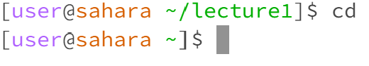
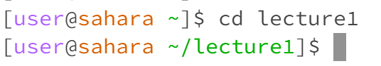
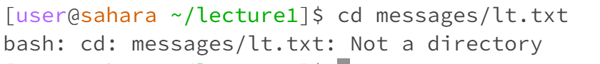
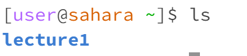
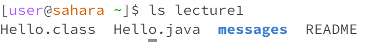
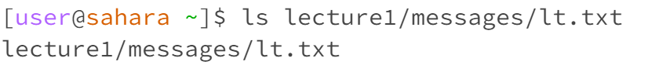
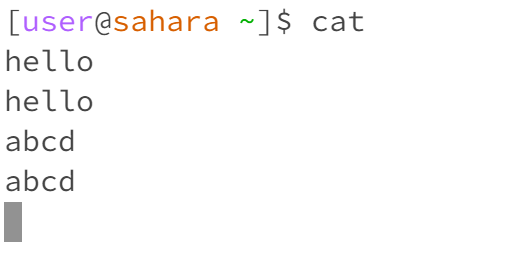
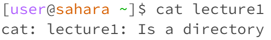
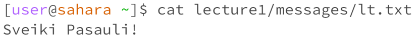

# CSE 15L Lab Report 1 - Adomas Vaitkus
**cd command examples:**

1.

   * 
   * The working directory when the code was run was /home/lecture1
   * The output with no arguments resulted in changing the directory back to /home
   * The output is not an error
2. 

   * 
   * The working directory when the code was run was /home
   * The output with a directory as the argument was the changing the directory to the one given, in this case the new directory is /home/lecture1
   * The output is not an error
3. 

   * 
   * The working directory when the code was run was /home/lecture1
   * The output with a file as the argument was an error message saying the file is not a directory
   * The output is an error as cd changes to a different directory and cannot have a file as the argument

**ls command examples:**

1.

  * 
  * The working directory whent the code was run was /home
  * The output was a list of all possible next steps in the directory path in this case the only possible one was lecture1
  * There was no error as it simply lists the possible following paths of the current directory

2.

  * 
  * The working directory when the code was run was /home
  * When given a directory as an argument, it lists all possible following steps for that directory which is shown when calling for ls lecture1
  * There was no error as lecture1 is a directory that can have following steps

3.

  * 
  * The working directory when the code was run was /home
  * The argument given was for a file, nothing can follow a file in the directory so therefore there was an error.
  * An error existed as ls must take the parameter of a directory not a file

**cat command examples:**

1.

  * 
  * The working directory when the code was run was /home
  * The lack of an argument has the cat command simply output nothing and wait for the user to put in a parameter. If the parameter is not the name of a directory or file, then it will simply reprint the same string.
  * An error does not exist in the this command other than the fact that without an argument to perform its operation on, it will simply be stuck infinitely.

2.

  * 
  * The working directory when the code was run was /home
  * The use of a directory results in an error for the command cat as it is meant to take in a file as its parameter
  * The error states directories cannot be used as a parameter for cat
  
3.

 * 
 * The working directory when the code was run was /home
 * When the parameter of a file was used, the cat command prints out the contents of the file.
 * There is no error as the cat command did as it is intended to do.
