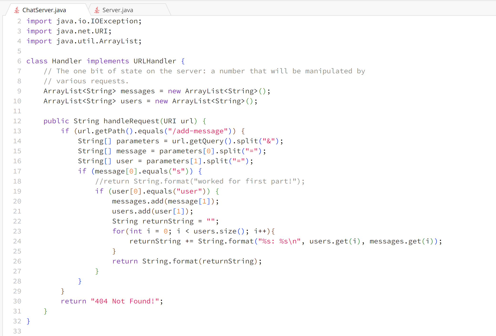
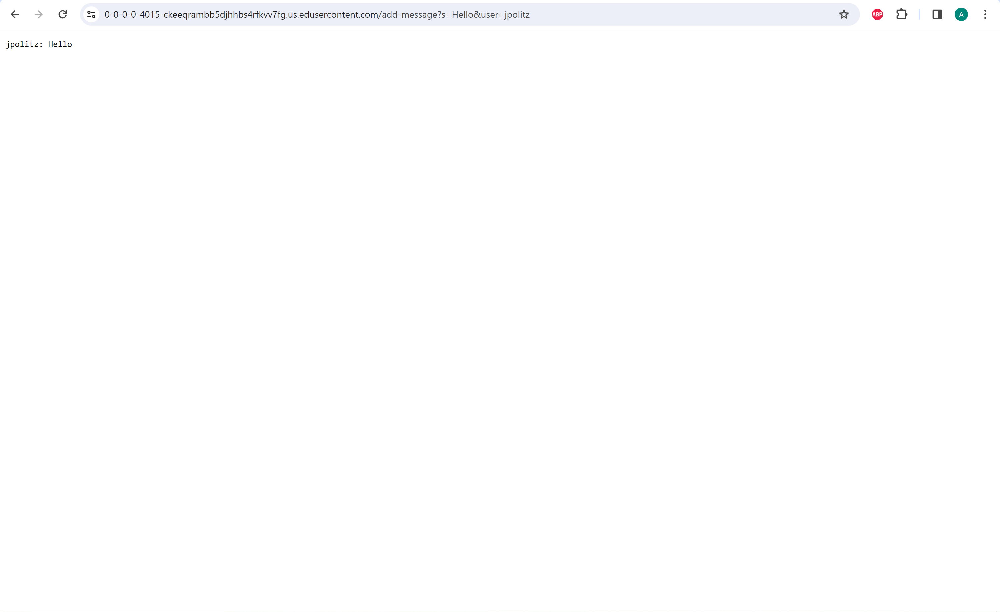
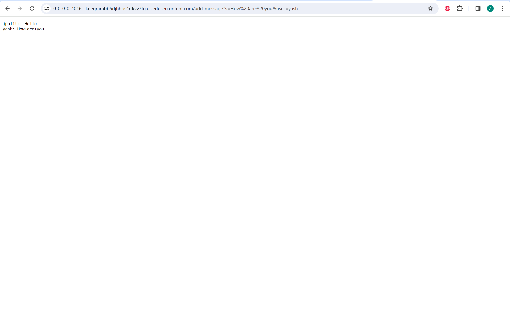
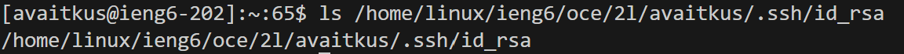
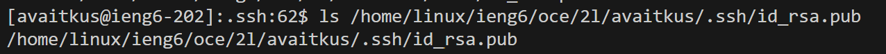

# CSE 15L Lab Report 2 - Adomas Vaitkus

**Part 1:**
ChatServer Code:

Using `/add-message`

* For this screenshot, the method `handleRequest` is called.
* The relevent arguments to this method are s=Hello and user=jpolitz. Two ArrayList fields were created to store the users and messages when `/add-message` is used. Each time, the user and message would be stored in the ArrayList.
* Elements are constantly being added to the `messages` and `users` ArrayLists in order to keep track of all the uses of `/add-message`.

* For this screenshot, the method `handleRequest` is called.
* The relevent argument to this method is the url of the server that was created. Two ArrayList fields were created to store the users and messages when `/add-message` is used. Each time, the user and message would be stored in the ArrayList.
* Elements are constantly being added to the `messages` and `users` ArrayLists in order to keep track of all the uses of `/add-message`. In this case, the first message in is also printed by accessing the values in the 0th indeces of the two ArrayLists.

**Part 2:**
Path to Private Key:

Path to Public Key:

No Password Login:
![Image](NoPasswordRequired.png

**Part 3:**
Something that I learned how to do these past two weeks is how urls work. Me, being someone who uses the internet regularly does not think much of the urls I use, now all that I see are things such as the path, domain, and parameters.
