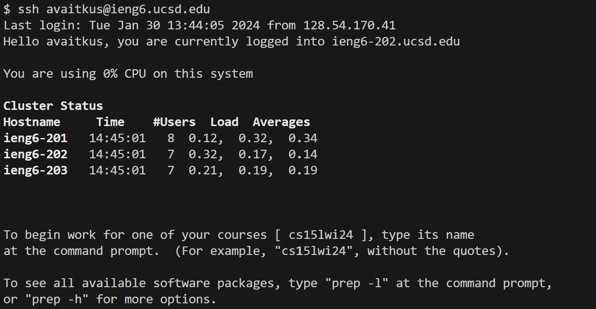

# CSE 15L Lab Report 2 - Adomas Vaitkus

**Part 1:**
ChatServer Code:

Using `/add-message`

* For this screenshot, the method `handleRequest` is called.
* The relevent arguments to this method are s=Hello and user=jpolitz. Two ArrayList fields, `messages` and `users`, were created when the server was started to store the users and messages. Each time `/add-message` was called the user and message would be stored in their respective ArrayLists.
* Each call adds the s parameter to the `messages` Arraylist and adds the user parameter to the `users` ArrayList in order to keep track of all the calls of `/add-message`.

* For this screenshot, the method `handleRequest` is called.
* The relevent arguments to this method are s=How%20are%20you (I expected to pass in "How are you") and user=yash. Two ArrayList fields, `messages` and `users`, were created when the server was started to store the users and messages. Each time `/add-message` was called the user and message would be stored in their respective ArrayLists.
* Each call adds the s parameter to the `messages` Arraylist and adds the user parameter to the `users` ArrayList in order to keep track of all the calls of `/add-message`. Since this was the second call since the server was started, it prints both the first call and this one.

**Part 2:**
Path to Private Key:

Path to Public Key:

No Password Login:

**Part 3:**
Something that I learned how to do these past two weeks is how urls work. Me, being someone who uses the internet regularly does not think much of the urls I use, now all that I see are things such as the path, domain, and parameters.
