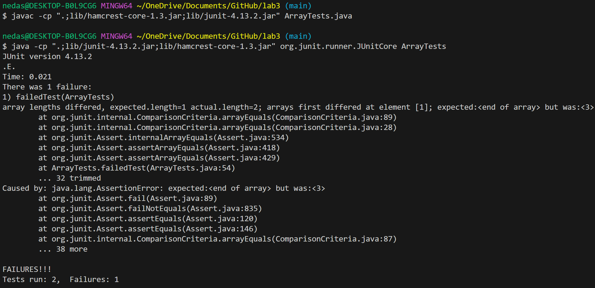

# CSE 15L Lab Report 3 - Adomas Vaitkus

**Part 1:**

Failure-inducing input as a J-Unit Test
```
@Test
  public void failedTest() {
    int[] input1 = {2, 3};
    ArrayExamples.reverseInPlace(input1);
    assertArrayEquals(new int[]{ 3 }, input1);
}
```

Passing input as a J-Unit Test
```
@Test
  public void falsePassTest() {
    int[] input1 = {3, 3};
    ArrayExamples.reverseInPlace(input1);
    assertArrayEquals(new int[]{3, 3}, input1);
}
```

Symptom of the bug as a screenshot of running both tests. Test 1 fails because input1 is not correctly reversed due to a bug in the code. Test 2 passes because the bug in the code does not affect an input where the array is symmetrical.


Original Bugged Code:
```
static void reverseInPlace(int[] arr) {
    for(int i = 0; i < arr.length/2; i += 1) {
      arr[i] = arr[arr.length - i - 1];
    }
}
```

Fixed Code:
```
static void reverseInPlace(int[] arr) {
    for(int i = 0; i < arr.length/2; i += 1) {
      int temp = arr[i];
      arr[i] = arr[arr.length - i - 1];
      arr[arr.length - i - 1] = temp;
    }
}
```

The fix addresses the issue since it allows swaps the opposite end elements of the array at the same time so the variable values are kept instead of losing the original value as it loops through.

**Part 2:**

Find Command-Line Options:

1. Find a single file by name:
```
$ find -name "chapter-1.txt"
./technical/911report/chapter-1.txt
```
```
$ find -name "1471-213X-1-4.txt"
./technical/biomed/1471-213X-1-4.txt
```
Found at: [https://www.redhat.com/sysadmin/linux-find-command](https://www.redhat.com/sysadmin/linux-find-command)


2. Find a single file by approximate name:
```
$ find -iname "1471-213X-2*txt"
./technical/biomed/1471-213X-2-1.txt
./technical/biomed/1471-213X-2-7.txt
./technical/biomed/1471-213X-2-8.txt
```
```
$ find -iname "chapter-13*txt"
./technical/911report/chapter-13.1.txt
./technical/911report/chapter-13.2.txt
./technical/911report/chapter-13.3.txt
./technical/911report/chapter-13.4.txt
./technical/911report/chapter-13.5.txt
```
Found at: [https://www.redhat.com/sysadmin/linux-find-command](https://www.redhat.com/sysadmin/linux-find-command)


3. Find files based on type(f for file, d for directory):
```
$ find ./technical/911report -type f
./technical/911report/chapter-1.txt
./technical/911report/chapter-10.txt
./technical/911report/chapter-11.txt
./technical/911report/chapter-12.txt
./technical/911report/chapter-13.1.txt
./technical/911report/chapter-13.2.txt
./technical/911report/chapter-13.3.txt
./technical/911report/chapter-13.4.txt
./technical/911report/chapter-13.5.txt
./technical/911report/chapter-2.txt
./technical/911report/chapter-3.txt
./technical/911report/chapter-5.txt
./technical/911report/chapter-6.txt
./technical/911report/chapter-7.txt
./technical/911report/chapter-8.txt
./technical/911report/chapter-9.txt
./technical/911report/preface.txt
```
Note* path `./technical/911report` is used to narrow the results, without it the demonstration would show all files in `./technical` which is too much to show in the above example
```
$ find -type d
./technical
./technical/911report
./technical/biomed
./technical/government
./technical/government/About_LSC
./technical/government/Alcohol_Problems
./technical/government/Env_Prot_Agen
./technical/government/Gen_Account_Office
./technical/government/Media
./technical/government/Post_Rate_Comm
./technical/plos
```
Found at: [https://www.baeldung.com/linux/find-command](https://www.baeldung.com/linux/find-command)


4. Find files based on their size(+ meaning greater and - meaning less than):
```
$ find -type f -size -2k
./technical/plos/pmed.0020191.txt
./technical/plos/pmed.0020226.txt
```
```
$ find -type f -size +250k
./technical/911report/chapter-13.4.txt
./technical/911report/chapter-13.5.txt
./technical/911report/chapter-3.txt
./technical/government/Gen_Account_Office/d01591sp.txt
./technical/government/Gen_Account_Office/Statements_Feb28-1997_volume.txt
```
Found at: [https://snapshooter.com/learn/linux/find](https://snapshooter.com/learn/linux/find)
