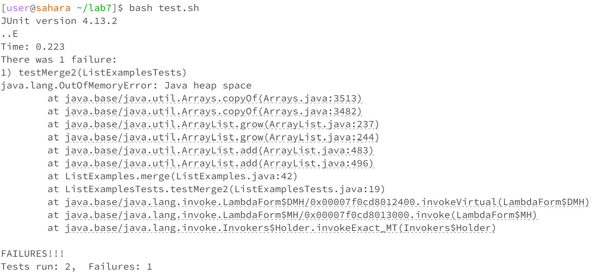

# CSE 15L Lab Report 5   - Adomas Vaitkus

This will mimic the code used in the Week 7 Lab:

**Part 1**

**Initial Post:**

Hey I'm am getting this error for my code on the ListExamples project, I am not sure what the issue is but I think it has something to do with either my merge code or the test case that is failing. I think I may be stuck in an infinite loop somewhere, any way I can get some help?

**Response:**

Hey! Glad to see you're working hard on your program for the ListExamples lab. If you think you are in an infinite loop, try checking your loop variables to make sure they increment/decrement. If that doesn't work try sending a screenshot of your test cases or coming to tutor hours so we can help you out in person!

Solution:

