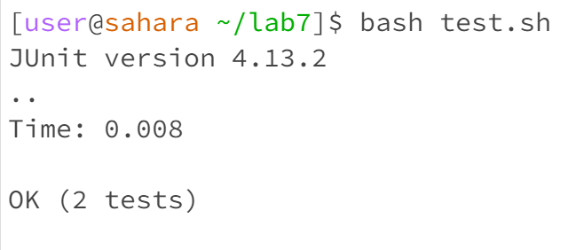

# CSE 15L Lab Report 5   - Adomas Vaitkus

This will mimic the code used in the Week 7 Lab:

**Part 1**

**Initial Post:**


Hey I'm am getting this error for my code on the ListExamples project, I am not sure what the issue is but I think it has something to do with either my merge code or the test case that is failing. I think I may be stuck in an infinite loop somewhere, any way I can get some help?


**Response:**

Hey! Glad to see you're working hard on your program for the ListExamples lab. If you think you are in an infinite loop, try checking your loop variables to make sure they increment/decrement. If that doesn't work try sending a screenshot of your test cases or coming to tutor hours so we can help you out in person!


**Solution:**



I tried checking my loop variables and that was it! I found that in my while loop where index2 was the loop variable, I was incrememnting index2 and this caused the infinite loop I mentioned earlier!

File and directory structure:
* lab 7
  * lib
    * hamcrest-core-1.3.java
    * junit-4.13.2.jar
  * ListExamples.class
  * ListExamples.java
  * ListExamplesTests.class
  * ListExamplesTests.java
  * StringChecker.class
  * test.sh

Files:

`ListExamples.java`

```
import java.util.ArrayList;
import java.util.List;

interface StringChecker { boolean checkString(String s); }

class ListExamples {

  // Returns a new list that has all the elements of the input list for which
  // the StringChecker returns true, and not the elements that return false, in
  // the same order they appeared in the input list;
  static List<String> filter(List<String> list, StringChecker sc) {
    List<String> result = new ArrayList<>();
    for(String s: list) {
      if(sc.checkString(s)) {
        result.add(0, s);
      }
    }
    return result;
  }


  // Takes two sorted list of strings (so "a" appears before "b" and so on),
  // and return a new list that has all the strings in both list in sorted order.
  static List<String> merge(List<String> list1, List<String> list2) {
    List<String> result = new ArrayList<>();
    int index1 = 0, index2 = 0;
    while(index1 < list1.size() && index2 < list2.size()) {
      if(list1.get(index1).compareTo(list2.get(index2)) < 0) {
        result.add(list1.get(index1));
        index1 += 1;
      }
      else {
        result.add(list2.get(index2));
        index2 += 1;
      }
    }
    while(index1 < list1.size()) {
      result.add(list1.get(index1));
      index1 += 1;
    }
    while(index2 < list2.size()) {
      result.add(list2.get(index2));
      index1 += 1; //this line was changed to index2
    }
    return result;
  }


}
```

`ListExamplesTests.java`

```
import static org.junit.Assert.*;
import org.junit.*;
import java.util.*;
import java.util.ArrayList;


public class ListExamplesTests {
	@Test(timeout = 500)
	public void testMerge1() {
    		List<String> l1 = new ArrayList<String>(Arrays.asList("x", "y"));
		List<String> l2 = new ArrayList<String>(Arrays.asList("a", "b"));
		assertArrayEquals(new String[]{ "a", "b", "x", "y"}, ListExamples.merge(l1, l2).toArray());
	}
	
	@Test(timeout = 500)
        public void testMerge2() {
		List<String> l1 = new ArrayList<String>(Arrays.asList("a", "b", "c"));
		List<String> l2 = new ArrayList<String>(Arrays.asList("c", "d", "e"));
		assertArrayEquals(new String[]{ "a", "b", "c", "c", "d", "e" }, ListExamples.merge(l1, l2).toArray());
        }

}
```

`test.sh`

```
javac -cp .:lib/hamcrest-core-1.3.jar:lib/junit-4.13.2.jar *.java
java -cp .:lib/hamcrest-core-1.3.jar:lib/junit-4.13.2.jar org.junit.runner.JUnitCore ListExamplesTests
```

Command lines run:
`bash test.sh`

What was changed?:
The line indicated in ListExamples.java was changed to be index2 instead of index1.


**Part 2**
I think I learned a lot this quarter, especially since this was my first computer science class in college that I was not coming in with almost all of the background necessary. I think learning how to write a bash script with it being its own sort of programming language really enjoyable, especially when it worked out. I liked building on our bash scripts throughout the quarter especially revisiting the grading scripts we made in week 6 this week. I think so far this has been my most enjoyable computer science class in college. Something small I learned that was cool was how to add a line that indicates the 80 character count in VSCode, even though this was not relevant for this class. I learned it at the beginning of one lab with my groupmates talking about our CSE12 labs which had to have all lines 80 or less characters and how it can be a pain seeing how many characters we have on each line.
